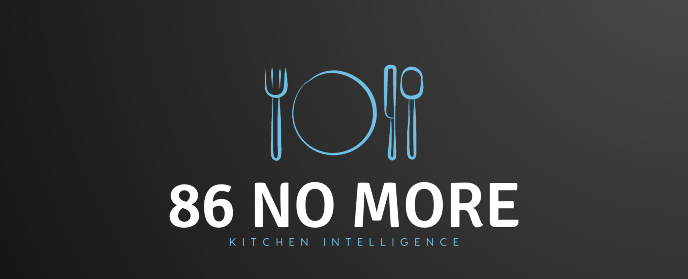

# 86 No More, A Kitchen Intelligence Solution
<p align="center"></p>


[](https://zenodo.org/badge/latestdoi/402155508)
[](https://www.java.com/en/)
[](https://github.com/elric97/CalBot/blob/master/LICENSE)
[](https://github.com/CSC510-Group-25/CSC510_Group25_Project1/issues)

Quantity Calculator:  
[](https://github.com/CSC510-Group-25/CSC510_Group25_Project1/actions/workflows/QtyCalcTests.yml)


## About:
As customers decide on what to order at a restaurant, there is no worse feeling than hearing your 
waiter tell them that their item of choice is no longer available. To prevent this issue,
we have created an inventory tracker that will be able to track all the quantities of ingredients but 
also have features that are beneficial to your restaurant. Our software will have
the ability to send notifications to the manager when quantities for certain items are running low.
In addition, our product will have an analytics page that will be able to display total sales, orders,
and amount of waste per month. This product will allow restaurants to become more profitable while also
being beneficial to the planet as there will be less waste generated in the restaurant industry.

### Watch this video to know more about our product:
https://user-images.githubusercontent.com/42051115/135004434-50d95b77-87a3-4c18-8d35-b680c63239b0.mp4

## Technologies we used:
<p align="left">
  <a href="https://www.java.com/en/" target="_blank"> 
    
  </a>
  <a href="https://spring.io/projects/spring-boot" target="_blank"> 
    
  </a>
  <a href="https://www.reactjs.org" target="_blank">
    
  </a>
  <a href="https://www.javascript.com" target="_blank"> 
    
  </a>
  <a href="https://developer.mozilla.org/en-US/docs/Glossary/CSS" target="_blank"> 
    
  </a>
  <a href="https://www.mysql.com/" target="_blank"> 
    
  </a>
</p> 

Java\
Spring Boot\
React\
Javascript\
CSS\
MySQL

## Demo:
Our Home Page


Every Restaurant will create an account with our application through the sign-up page and login\


After signing up, the user can check the inventory that they currently have left\


When certain ingredients are running low or about to expire, they will be notified\


The user may go to the analytics page to see analysis of how their restaurant is doing monthly


## Steps for Running Backend:
You can directly use Eclipse or Intellj to open up the project and run SpringSocialApplication.java file. You can also the start code from terminal. You need to update sql username and password in resources/application.yml file.

Go to spring-social folder and run 
```bash
mvn spring-boot:run
```
You also need to setup mysql. Make sure that mysql is installed in your local machine. After that run the following command inside spring-social folder

```bash
mysql -u root -p < create_table.sql
```

For plotting the line graphs use below versions:
```bash
npm i react-chartjs-2@2.11.1
npm i chart.js@2.9.4

```

This command will create the database inventory_tracker and inside the database, users table will be formed. 


Alternatively, if you're having trouble running this command, you can create the necessary tables through MySQL Workbench:  
```
In MySQL Workbench: Go to File > run SQL script > create_table.sql (inside spring-social folder)
```

## Steps for Running Frontend:
In a separate terminal window go to react-social folder and run
```bash
npm install
```
this will download all the dependencies in local node_module folder\
then type the next command
```bash
npm start
```
this will start the application on localhost:3000


### Steps for running Quantity Calculator
https://github.com/CSC510-Group-25/CSC510_Group25_Project1/tree/main/qty_calc

## Funding:
The project is not currently funded

## Future

See issues here: https://github.com/CSC510-Group-25/CSC510_Group25_Project1/issues

## Authors
* Emily Tracey
* Jonathan Nguyen 
* Peeyush Taneja
* Leila Moran
* Shraddha Mishra

